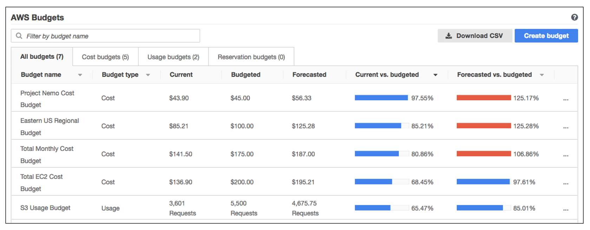

# `Module 8 - Pricing and Support`

## `8.1 AWS Free Tier`

- [`AWS Free Tier`](https://aws.amazon.com/free/) - enables you to begin using certain services without having to worry about incurring costs for the specified period.
- #### `Always free`
  - Do not expire and are available to all AWS customers.
  - `Example`: AWS Lambda allows 1 million free requests and up to 3.2 million seconds of compute time per month. Amazon DynamoDB allows 25 GB of free storage per month.
- #### `12 months free`
  - Free for 12 months following your initial sign-up date to AWS.
  - `Example`: include specific amounts of Amazon S3 Standard Storage, thresholds for monthly hours of Amazon EC2 compute time, and amounts of Amazon CloudFront data transfer out.
- #### `Trials`
  - Short-term free trial offers start from the date you activate a particular service. The length of each trial might vary by number of days or the amount of usage in the service.
  - `Example`: Amazon Inspector offers a 90-day free trial. Amazon Lightsail (service to run virtual private servers) offers 750 free hours of usage over a 30-day period.

## `8.2 AWS Pricing Concepts`

- ### `How AWS Pricing Works`
  - #### `Pay for what you use`
    - Pay for exactly the amount of resources for each service.
    - Without long-term contracts or complex licensing.
  - #### `Pay less when you reserve`
    - Some service offers reservation options that provide a significant discount compared to On-Demand Instance pricing.
  - #### `Pay less with volume-based discounts when you use more`
    - Some services offer tiered pricing, so the per-unit cost is incrementally lower with increased usage.
- ### `AWS Pricing Calculator`

  - [`AWS Pricing Calculator`](https://calculator.aws/#/)
    ```
    - Estimate the cost of your use cases on AWS.
    - organize your AWS estimates by groups that you define.
    - Once an estimate has been created, you can save it and generate a link to share with others.
    ```
    

- ### `AWS Pricing Examples`
  - #### `AWS Lambda`
    - Charged based on the number of requests for functions and time it takes to run them.
    - `Paying less when you reserve.`
  - #### `Amazon EC2`
    - `Pay for only the compute time used` while the instances are running.
    - Additional cost savings: Savings Plans and Reserved Instances.
  - #### `Amazon S3`
    - `Storage`
      - pay for only the storage that you use.
    - `Requests and Data Retrievals`
      - pay for requests made to your Amazon S3 objects and buckets.
    - `Data Transfer`
      - Pay for data that you transfer into and out of Amazon S3.
      - No cost for data transferred into Amazon S3 from the internet or out to Amazon CloudFront.
      - No cost for data transferred out to an Amazon EC2 instance in the same AWS Region as the Amazon S3 bucket.
    - `Management and Replication`
      - Pay for enabled storage management features on your account’s Amazon S3 buckets.
      - Includes Amazon S3 inventory, analytics, and object tagging.

## `8.3 Billing Dashboard`

- [`AWS Billing & Cost Management Dashboard`](https://docs.aws.amazon.com/awsaccountbilling/latest/aboutv2/billing-what-is.html) - pay your AWS bill, monitor your usage, and analyze and control your costs.
  - Compare your current month-to-date balance with the previous month, and get a forecast of the next month based on current usage.
  - View month-to-date spend by service.
  - View Free Tier usage by service.
  - Access Cost Explorer and create budgets.
  - Purchase and manage Savings Plans.
  - Publish [`AWS Cost and Usage Reports`](https://docs.aws.amazon.com/cur/latest/userguide/what-is-cur.html).

## `8.4 Consolidated Billing`

- `AWS Organizations` also provides the option for [`consolidated billing`](https://docs.aws.amazon.com/awsaccountbilling/latest/aboutv2/consolidated-billing.html).
- Receive a `single bill` for all AWS accounts in your organization.
- Share bulk discount pricing, Savings Plans, and Reserved Instances across the accounts in your organization.
- Easily track the combined costs of all the linked accounts in your organization.
- The `default maximum` number of accounts allowed for an organization is `4`.
- You can contact AWS Support to increase your quota, if needed.

## `8.5 AWS Budgets`

- Create budgets to plan your service usage, service costs, and instance reservations.
- The information in AWS Budgets `updates 3 times a day`.
- Set custom alerts when your usage exceeds (or is forecasted to exceed) the budgeted amount.

  

## `8.6 AWS Cost Explorer`

- A tool that lets you visualize, understand, and manage your AWS costs and usage over time.
- Includes a default report of the costs and usage for your `top five cost-accruing` AWS services.
- Apply custom filters and groups to analyze your data.

  

## `8.7 AWS Support Plans`

- ### `Basic Support`
  - Free for all AWS customers.
  - Access to whitepapers, documentation, and support communities.
  - Contact AWS for billing questions and service limit increases.
  - Access to a limited selection of AWS Trusted Advisor checks.
- ### `Developer, Business, Enterprise On-Ramp, and Enterprise Support`
  - Includes all the benefits of Basic Support.
  - Ability to open an unrestricted number of technical support cases.
  - `Pay-by-the-month pricing` and require no long-term contracts.
  - `Pricing`:
    - `lowest cost` - Developer plan.
    - `Middle` - Business and Enterprise On-Ramp plan.
    - `Highest cost` - Enterprise plan.
  - #### `Developer Support`
    - Best practice guidance.
    - Client-side diagnostic tools.
    - Building-block architecture support. (Guidance for how to use AWS offerings, features, and services together)
  - #### `Business Support`
    - Use-case guidance to identify AWS offerings, features, and services that can best support your specific needs.
    - All AWS Trusted Advisor checks.
    - Limited support for third-party software. (OS, Application Stack Components)
  - #### `Enterprise On-Ramp Support`
    - A pool of Technical Account Managers to provide proactive guidance and coordinate access to programs and AWS experts.
    - A Cost Optimization workshop. `(one per year)`
    - A Concierge support team for billing and account assistance.
    - Tools to monitor costs and performance through Trusted Advisor and Health API/Dashboard.
    - `Support provided by a pool of Technical Account Managers`:
      - Consultative review and architecture guidance. `(one per year)`
      - Infrastructure Event Management support. `(one per year)`
      - Support automation workflows.
      - `30 minutes or less response time` for business-critical issues.
  - #### `Enterprise Support`
    - A designated Technical Account Manager to provide proactive guidance and coordinate access to programs and AWS experts.
    - A Concierge support team for billing and account assistance.
    - Operations Reviews and tools to monitor health.
    - Training and Game Days to drive innovation.
    - Tools to monitor costs and performance through Trusted Advisor and Health API/Dashboard.
    - `Support provided by a designated Technical Account Manager`:
      - Consultative review and architecture guidance.
      - Infrastructure Event Management support.
      - Cost Optimization Workshop and tools.
      - Support automation workflows.
      - `15 minutes or less response time` for business-critical issues.
- ### `Technical Account Manager (TAM)`
  - The `Enterprise On-Ramp` and `Enterprise` Support plans include access to a `Technical Account Manager (TAM)`.
  - Primary point of contact at AWS.
  - Educates, empowers, and evolves your cloud journey across the full range of AWS services.
  - Provide expert engineering guidance, design solutions that efficiently integrate AWS services, assist with cost-effective and resilient architectures, and provide direct access to AWS programs and a broad community of experts.

## `8.8 AWS Marketplace`

- Digital catalog that includes thousands of software listings from independent software vendors.
- Find, test, and buy software that runs on AWS.
- ### `AWS Marketplace Categories`
  

## `Additional Sources`

- [`AWS Pricing`](https://aws.amazon.com/pricing)
- [`AWS Free Tier`](https://aws.amazon.com/free)
- [`AWS Cost Management`](https://aws.amazon.com/aws-cost-management/)
- [`Whitepaper: How AWS Pricing Works`](https://d1.awsstatic.com/whitepapers/aws_pricing_overview.pdf)
- [`Whitepaper: Introduction to AWS economies`](https://d1.awsstatic.com/whitepapers/introduction-to-aws-cloud-economics-final.pdf)
- [`AWS Support`](https://aws.amazon.com/premiumsupport)
- [`AWS Knowledge Center`](https://aws.amazon.com/premiumsupport/knowledge-center/)
