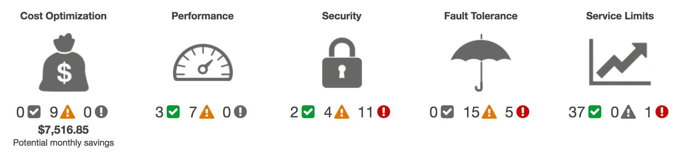

# `Module 7 - Monitoring and Analytics`

## `7.1 Amazon CloudWatch`

- ### `Amazon CloudWatch`
  - Web service that enables you to monitor and manage various metrics and configure alarm actions based on data from those metrics.
  - Uses [`metrics`](https://docs.aws.amazon.com/AmazonCloudWatch/latest/monitoring/working_with_metrics.html) to represent the data points for your resources.
  - CloudWatch uses metrics to create graphs automatically that show how performance has changed over time.
- ### `CloudWatch Alarms`
  - Create [`alarms`](https://docs.aws.amazon.com/AmazonCloudWatch/latest/monitoring/AlarmThatSendsEmail.html) that automatically perform actions if the value of your metric has gone above or below a predefined threshold.
  - Automatically stops an Amazon EC2 instance when the CPU utilization percentage has remained below a certain threshold for a specified period.
- ### `CloudWatch Dashboard`

  

  - Enables you to access all the metrics for your resources from a single location.
  - `Example`: Monitor the CPU utilization of an Amazon EC2 instance, the total number of requests made to an Amazon S3 bucket, and more. You can even customize separate dashboards for different business purposes, applications, or resources.

## `7.2 AWS CloudTrail`

- ### `AWS CloudTrail`
  - Records API calls for your account.
  - Recorded information includes the identity of the API caller, the time of the API call, the source IP address of the API caller, and more.
  - View a complete history of user activity and API calls for your applications and resources.
- ### `CloudTrail Insights`
  - Optional feature that allows CloudTrail to automatically detect unusual API activities in your AWS account.

## `7.3 AWS Trusted Advisor`

- [`AWS Trusted Advisor`](https://aws.amazon.com/premiumsupport/technology/trusted-advisor/) - Web service that inspects your AWS environment and provides real-time recommendations in accordance with AWS best practices.
- `Compares its findings to AWS best practices in five categories`:

  ```
  - cost optimization
  - performance
  - security
  - fault tolerance
  - service limits
  ```

- ### `AWS Trusted Advisor Dashboard`

  

  - Access the Trusted Advisor dashboard on the AWS Management Console, you can review completed checks for cost optimization, performance, security, fault tolerance, and service limits.

  - `The green tick` indicates the number of items for which it detected no problems.
  - `The orange triangle` represents the number of recommended investigations.
  - `The red circle` represents the number of recommended actions.

## `Additional Resources`

- [`Management and Governance on AWS`](https://aws.amazon.com/products/management-tools)
- [`Monitoring and Observability`](https://aws.amazon.com/products/management-tools/use-cases/monitoring-and-observability/)
- [`Configuration, Compliance, and Auditing`](https://aws.amazon.com/products/management-tools/use-cases/configuration-compliance-and-auditing/)
- [`AWS Management & Governance Blog`](https://aws.amazon.com/blogs/mt/)
- [`Whitepaper: AWS Governance at Scale`](https://docs.aws.amazon.com/whitepapers/latest/aws-governance-at-scale/introduction.html)
