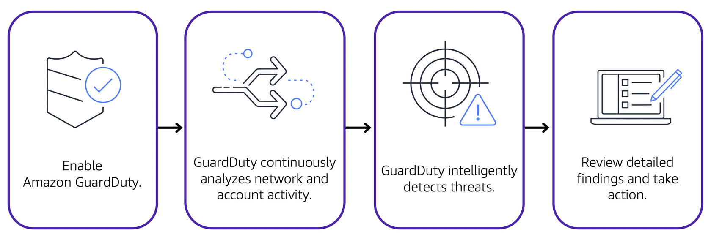

# `Module 6 - Security`

## `6.1 AWS Shared Responsibility Model`


- ### `Customers: Security in the Cloud`
  - Customers are responsible for the security of everything that they create and put `in the AWS Cloud`.
  - Customers are `responsible` for managing security requirements for their content, including content they store and which AWS services they use.
  - Customers also control how access rights are granted, managed, and revoked.
- ### `AWS: Security of the Cloud`
  - AWS is responsible for security `of the cloud`.
  - AWS `operates`, `manages`, and `controls` the components at `all layers of infrastructure`. (host OS virtualization layer, physical security of the data centers)
  - AWS is responsible for `protecting the global infrastructure` that runs all of the services offered in the AWS Cloud. ( AWS Regions, Availability Zones, and edge locations )
  - AWS manages the security of the cloud, specifically the `physical infrastructure` that hosts your resources, which include:
    ```
    - Physical security of data centers
    - Hardware and software infrastructure
    - Network infrastructure
    - Virtualization infrastructure
    ```

## `6.2 User Permissions and Access`

- ### `AWS Identity and Access Management (IAM)`
  - Manage access to AWS services and resources securely.
  - Flexibility to configure access based on your company’s operational and security needs.
  - `IAM features includes`:
    - `IAM users, groups, and roles.`
    - `IAM policies.`
    - `Multi-factor authentication.`
- ### `AWS account root user`
  
  - #### `Best Practices`
    - Do not use the root user for everyday tasks.
    - Create your first IAM user and assign it permissions to create other users.
    - Create other IAM users, and access those identities for performing regular tasks throughout AWS.
    - Only use the root user when you need to perform tasks that are only available to the root user. For example, changing root user email address and changing your AWS support plan.
    - [`AWS Account Management Reference Guide`](https://docs.aws.amazon.com/IAM/latest/UserGuide/root-user-tasks.html)
- ### `IAM Users`
  - Identity that root user creates in AWS.
  - Represents a person or application that interacts with AWS services and resources.
  - Consists of a name and credentials.
  - By default, IAM users has no permissions associated with it.
  - #### `Best Practices`
    - Create individual IAM users for each person who needs to access AWS.
    - Provides additional security by allowing each IAM user to have a unique set of security credentials.
- ### `IAM Policies`

  - Document that allows or denies permissions to AWS services and resources.
  - Customize users’ levels of access to resources.
  - #### `Best Practices`
    - Follow the security principle of least privilege when granting permissions.
    - Prevent users or roles from having more permissions than needed to perform their tasks.
  - #### `Example`

    

    - Allows a specific action within Amazon `S3:ListObject`.
    - Mentions a specific bucket ID: `AWSDOC-EXAMPLE-BUCKET`.
    - Allow the cashier to view all of the objects in the `AWSDOC-EXAMPLE-BUCKET` bucket.

- ### `IAM Groups`

  - Collection of IAM users.
  - All users in the group are granted permissions specified by the policy.

    

- ### `IAM Roles`

  - An identity that you can assume to gain temporary access to permissions.
  - Before an IAM user, application, or service can assume an IAM role, they must be granted permissions to switch to the role.
  - Abandons all previous permissions that they had under a previous role and assume the permissions of the new role.
  - #### `Best Practices`
    - IAM roles are ideal for situations in which access to services or resources needs to be granted temporarily, instead of long-term.

- ### `Multi-factor authentication`
  - Provides an extra layer of security for your AWS account.

## `4.3 AWS Organizations`

- Consolidate and manage multiple AWS accounts within a central location.
- Automatically creates a root, which is the parent container for all the accounts in your organization.
- Centrally control permissions for the accounts in your organization by using [`service control policies (SCPs)`](https://docs.aws.amazon.com/organizations/latest/userguide/orgs_manage_policies_scps.html).
- `SPC` allows you to place restrictions on the AWS services, resources, and individual API actions that users and roles in each account can access.
- ### `Organizational units`
  - Group accounts into `organizational units (OUs)` to make it easier to manage accounts with similar business or security requirements.
  - All accounts in the `OU` automatically inherit the permissions specified in the applied policy.
  - Easily isolate workloads or applications that have specific security requirements.

## `4.4 Compliance`

- ### `AWS Artifact`
  - Service that provides on-demand access to AWS security and compliance reports and select online agreements.
  - #### `AWS Artifact Agreements`
    - Review, accept, and manage agreements for an individual account and for all your accounts in AWS Organizations.
    - `Use case`: sign an agreement with AWS regarding your use of certain types of information throughout AWS services.
  - #### `AWS Artifact Reports`
    - Provide compliance reports from third-party auditors.
    - `Use case`: access information about their responsibility for complying with certain regulatory standards.
  - #### `The following are some of the compliance reports and regulations that you can find within AWS Artifact. Each report includes a description of its contents and the reporting period for which the document is valid.`
    
- ### `Customer Compliance Center`
  - [`Customer Compliance Center`](https://aws.amazon.com/compliance/customer-center/) - Contains resources to help you learn more about AWS compliance.
  - Read customer compliance stories to discover how companies in regulated industries have solved various compliance, governance, and audit challenges.
  - `Access compliance whitepapers and documentation` on topics such as:
    - `AWS answers to key compliance questions.`
    - `An overview of AWS risk and compliance.`
    - `An auditing security checklist.`
  - Includes an auditor `learning path`.
  - this `learning path` is designed for individuals in auditing, compliance, and legal roles who want to learn more about how their internal operations can demonstrate compliance using the AWS Cloud.

## `4.5 Designated Denial-of-Service Attacks (DDoS Attack)`

- ### `Denial-of-Service Attacks`

  - A deliberate attempt to make a website or application unavailable to users.
  - `Example`: an attacker floods a website or application with excessive network traffic until the targeted website or application becomes overloaded and is no longer able to respond.

    

- ### `Distributed Denial-of-Service Attacks`

  - Multiple sources are used to start an attack that aims to make a website or application unavailable.
  - `Example`: attacker/attackers can use multiple infected computers (also known as “bots”) to send excessive traffic to a website or application.

    

- ### `AWS Shield`
  - Service that protects applications against DDoS attacks.
  - #### `AWS Shield Standard`
    - Automatically protects all AWS customers at no cost.
    - Protects AWS resources from the most common, frequently occurring types of DDoS attacks.
  - #### `AWS Shield Advance`
    - Paid service that provides detailed attack diagnostics and the ability to detect and mitigate sophisticated DDoS attacks.
    - Integrates with other services such as `Amazon CloudFront`, `Amazon Route 53`, and `Elastic Load Balancing`.
    - Integrate AWS Shield with `AWS WAF` by writing `custom rules` to mitigate complex DDoS attacks.

## `4.6 Additional Security Services`

- ### `AWS Key Management Service (AWS KMS)`
  - Enables you to perform encryption operations through the use of `cryptographic keys`.
  - Create, manage, and use `cryptographic keys`.
  - A `cryptographic key` is a random string of digits used for encrypting and decrypting data.
  - Choose the specific levels of access control that you need for your keys.
  - Keys never leave `AWS KMS`, and you are always in control of them.
- ### `AWS WAF`
  - Web application firewall that lets you monitor network requests that come into your web applications.
  - Works together with `Amazon CloudFront` and an `Application Load Balancer`.
  - Uses [`web ACL`](https://docs.aws.amazon.com/waf/latest/developerguide/web-acl.html) to protect your AWS resources.
- ### `Amazon Inspector`
  - Improves the security and compliance of applications by running `automated security assessments`.
  - Checks applications for security vulnerabilities and deviations from security best practices, such as open access to Amazon EC2 instances and installations of vulnerable software versions.
- ### `Amazon GuardDuty`

  - Service that provides `intelligent threat detection` for your AWS infrastructure and resources.
  - Identifies threats by continuously monitoring the network activity and account behavior within your AWS environment.

    

## `Additional Resources`

- [`Security, Identity, and Compliance on AWS`](https://aws.amazon.com/products/security)
- [`Whitepaper: Introduction to AWS Security`](https://docs.aws.amazon.com/whitepapers/latest/introduction-aws-security/welcome.html)
- [`Whitepaper: Amazon Web Services - Overview of Security Processes`](https://docs.aws.amazon.com/whitepapers/latest/aws-overview-security-processes/aws-overview-security-processes.pdf)
- [`AWS Security Blog`](https://aws.amazon.com/blogs/security/)
- [`AWS Compliance`](https://aws.amazon.com/compliance)
- [`AWS Customer Stories: Security, Identity, and Compliance`](https://aws.amazon.com/solutions/case-studies/?customer-references-cards.sort-by=item.additionalFields.publishedDate&customer-references-cards.sort-order=desc&awsf.customer-references-location=*all&awsf.customer-references-segment=*all&awsf.customer-references-product=product%23vpc%7Cproduct%23api-gateway%7Cproduct%23cloudfront%7Cproduct%23route53%7Cproduct%23directconnect%7Cproduct%23elb&awsf.customer-references-category=category%23security-identity-compliance)
- [`Security best practices in IAM`](https://docs.aws.amazon.com/IAM/latest/UserGuide/best-practices.html)
