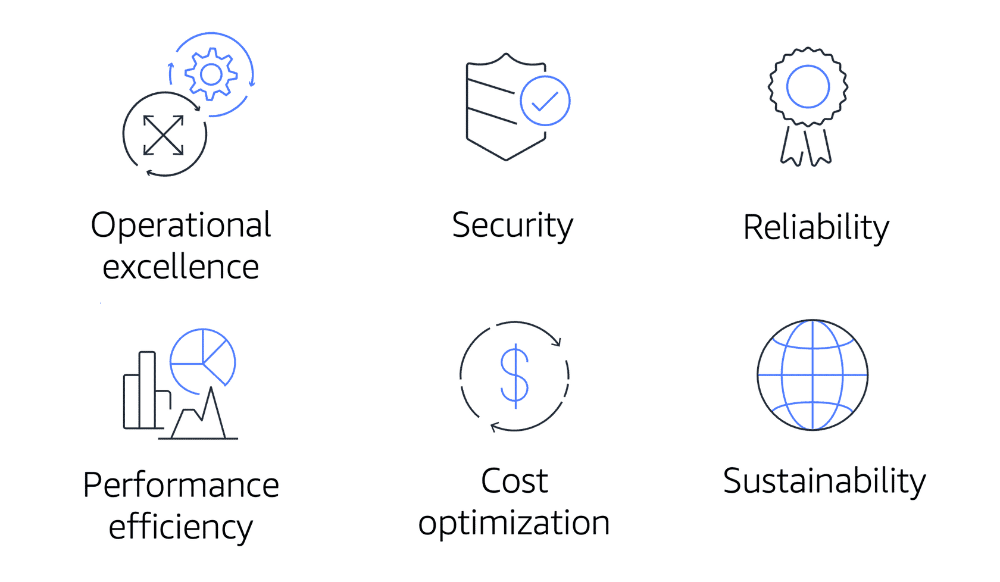

# `Module 10 - The Cloud Journey`

## `10.1 The AWS Well-Architected Framework`

- The [`AWS Well-Architected Framework`](https://docs.aws.amazon.com/wellarchitected/latest/framework/welcome.html) helps you understand how to design and operate reliable, secure, efficient, and cost-effective systems in the AWS Cloud.
  
- ### `Operational Excellence`
  - Ability to run and monitor systems to deliver business value and to continually improve supporting processes and procedures.
  - `Design principles`: performing operations as code, annotating documentation, anticipating failure, and frequently making small, reversible changes.
- ### `Security`
  - Ability to protect information, systems, and assets while delivering business value through risk assessments and mitigation strategies.
  - `Best Practices`:
    - Automate security best practices when possible.
    - Apply security at all layers.
    - Protect data in transit and at rest.
- ### `Reliability`
  - Includes testing recovery procedures, scaling horizontally to increase aggregate system availability, and automatically recovering from failure.
  - `Example`:
    - Recover from infrastructure or service disruptions.
    - Dynamically acquire computing resources to meet demand.
    - Mitigate disruptions such as misconfigurations or transient network issues.
- ### `Performance Efficiency`
  - Ability to use computing resources efficiently to meet system requirements and to maintain that efficiency as demand changes and technologies evolve.
  - `Example`:
    - Experimenting more often.
    - Using serverless architectures.
    - Designing systems to be able to go global in minutes.
- ### `Cost Optimization`
  - Ability to run systems to deliver business value at the lowest price point.
  - `Example`:
    - Adopting a consumption model.
    - Analyzing and attributing expenditure.
    - Using managed services to reduce the cost of ownership.
- ### `Sustainability`

  - Ability to continually improve sustainability impacts by reducing energy consumption and increasing efficiency across all components of a workload by maximizing the benefits from the provisioned resources and minimizing the total resources required.
  - `To facilitate good design for sustainability`:
    - Understand your impact.
    - Establish sustainability goals.
    - Maximum utilization.
    - Antixipate and adopt new, more efficient hardware and software offerings.
    - Use managed services.
    - Reduce the downstream impact of your cloud workloads.

## `10.2 Benefits of the AWS Cloud`

- ### `Advantages of Cloud Computing`
  - Trade upfront expense for variable expense.
  - Benefit from massive economies of scale.
  - Stop guessing capacity.
  - Increase speed and agility.
  - Stop spending money running and maintaining data centers.
  - Go global in minutes.

## `Additional Resources`

- [`AWS Well-Architected`](https://aws.amazon.com/architecture/well-architected/)
- [`AWS Well-Architected Framework`](https://docs.aws.amazon.com/wellarchitected/latest/framework/welcome.html)
- [`AWS Architecture Center`](https://aws.amazon.com/architecture)
- [`Six Advantages of Cloud COmputing`](https://docs.aws.amazon.com/whitepapers/latest/aws-overview/six-advantages-of-cloud-computing.html)
- [`AWS Architecture Blog`](https://aws.amazon.com/blogs/architecture)
